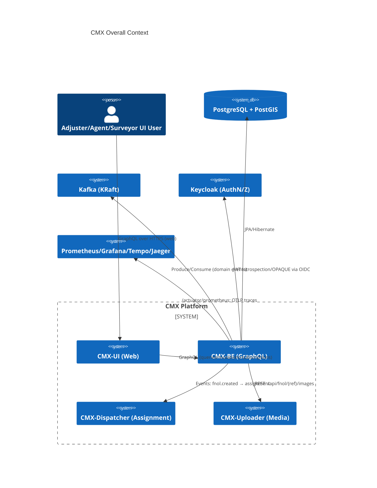
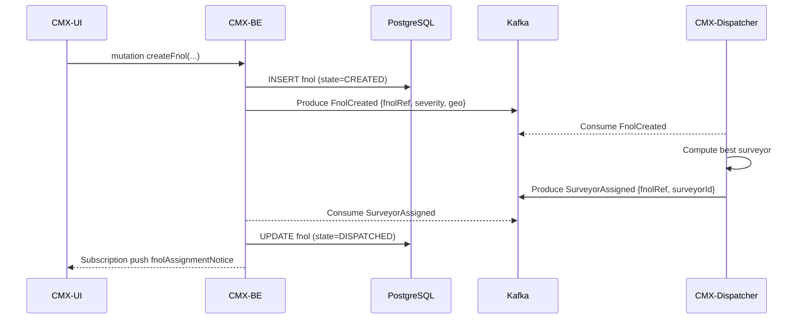

# CMX-BE — Backend Architecture (Detailed v1)

> **Context**: CMX-BE is the core domain backend for the Claims MotorX platform. It exposes GraphQL APIs, persists domain data to PostgreSQL/PostGIS, emits domain events to Kafka, and integrates with CMX-Dispatcher (assignment engine) and CMX-Uploader (media service). Non‑functional pillars include security (Keycloak), observability (Micrometer/OTel → Prometheus/Grafana + Tempo/Jaeger), reliability (idempotency/transactions), and deployability (Docker/K8s).

---

## 1) Architecture Overview

### 1.1 Component Landscape



### 1.2 Logical Layers

- **API Layer**: GraphQL (Queries/Mutations/Subscriptions) via Spring for GraphQL.
- **Application Layer**: Use cases (services), transactions, orchestration, validation, anti‑corruption (DTO↔Domain mapping w/ MapStruct).
- **Domain Layer**: Entities, value objects, aggregates, domain services, events.
- **Infrastructure Layer**: JPA repositories, Kafka producers/consumers, external REST clients (Uploader), security adapters, configuration, persistence.

---

## 2) Domain Model (Core)

### 2.1 Aggregates & Invariants

- **Policy** *(root)*: owns policy lifecycle (status, dates, premium, sum insured). Invariant: `policy_number` unique; `vehicle_id` one active policy at a time.
- **Vehicle**: VIN/plate, make/model/year, geo hints.
- **Insured**: party details.
- **FNOL (First Notice of Loss)** *(root)*: captures incident, severity, accident date/time, accident location (Address). Invariants: immutable `fnol_reference_no` format `TH-AT-FN-######` (or configured prefix); state machine `FNOLState` (CREATED → VALIDATED → DISPATCHED → CLOSED/REJECTED).
- **Claim** *(root)*: linked to FNOL (1:1 or 1:N depending on jurisdiction); `claim_number` format `TH-AT-CL-######`, uniqueness and monotonicity per business rule.
- **Surveyor**: human resource with status/skills/geo coverage.
- **Address**: accident site, insured address, garage, etc. (with PostGIS `POINT( lon lat )`).

### 2.2 Key Enums

- `ClaimStatus { OPEN, IN_REVIEW, APPROVED, REJECTED, CLOSED }`
- `FNOLState { CREATED, VALIDATED, DISPATCHED, COMPLETED, REJECTED }`
- `ClaimSeverity { LOW, MEDIUM, HIGH }`
- `PolicyStatus { ACTIVE, LAPSED, CANCELLED, EXPIRED }`
- `SurveyorStatus { AVAILABLE, BUSY, OFFLINE }`

### 2.3 Event Types

- `FnolCreated`, `FnolValidated`, `SurveyorAssigned`, `ClaimCreated`, `ClaimUpdated` (CloudEvents-style attributes: `id`, `source`, `type`, `time`, `specversion`, `subject`).

---

## 3) Data Architecture

### 3.1 PostgreSQL/PostGIS

- **Schema**: `public` (or `cmx` if multi‑tenant). All business tables with auditing columns: `created_at`, `updated_at`, `created_by`, `updated_by`.
- **Indexes**: unique indexes on business IDs (`policy_number`, `fnol_reference_no`, `claim_number`) + GIST index on geography columns.
- **Sequences**: `claim_no_seq`, `fnol_no_seq` or **database‑side function** to generate formatted numbers atomically.
- **Constraints**: FK with `ON UPDATE CASCADE`; check constraints for enums; partial indexes for “active” records.

#### 3.1.1 Sample Table Sketch (abbrev.)

```sql
CREATE TABLE claim (
  id BIGSERIAL PRIMARY KEY,
  claim_number VARCHAR(20) NOT NULL UNIQUE,
  fnol_id BIGINT NOT NULL REFERENCES fnol(id),
  status VARCHAR(20) NOT NULL,
  severity VARCHAR(10),
  description TEXT,
  created_at TIMESTAMP NOT NULL DEFAULT now(),
  updated_at TIMESTAMP NOT NULL DEFAULT now()
);

CREATE TABLE fnol (
  id BIGSERIAL PRIMARY KEY,
  fnol_reference_no VARCHAR(20) NOT NULL UNIQUE,
  incident_description TEXT,
  severity VARCHAR(10),
  accident_date TIMESTAMP NOT NULL,
  accident_location_id BIGINT REFERENCES address(id),
  state VARCHAR(20) NOT NULL,
  created_at TIMESTAMP NOT NULL DEFAULT now(),
  updated_at TIMESTAMP NOT NULL DEFAULT now()
);

CREATE TABLE address (
  id BIGSERIAL PRIMARY KEY,
  address_line1 VARCHAR(255),
  city VARCHAR(255), province VARCHAR(255), country VARCHAR(255), postal_code VARCHAR(32),
  location_type VARCHAR(32) NOT NULL,
  geom geography(Point, 4326),
  created_at TIMESTAMP NOT NULL DEFAULT now(),
  updated_at TIMESTAMP NOT NULL DEFAULT now()
);

CREATE INDEX idx_address_geom_gist ON address USING GIST(geom);
```

### 3.2 Number Generation Strategy

- Prefer **DB function** for atomicity and collision avoidance:

```sql
CREATE SEQUENCE claim_no_seq;
CREATE OR REPLACE FUNCTION next_claim_number()
RETURNS TEXT AS $$
DECLARE n BIGINT;
BEGIN
  n := nextval('claim_no_seq');
  RETURN 'TH-AT-CL-' || lpad(n::text, 6, '0');
END;
$$ LANGUAGE plpgsql;
```

- Enforce with **BEFORE INSERT** trigger on `claim`.

---

## 4) API Design (GraphQL)

### 4.1 Queries

- `getAllClaims(): [Claim!]!`
- `getClaimById(id: ID!): Claim`
- `getClaimsByStatus(status: ClaimStatus!): [Claim!]!`
- `getAllFnol(): [FnolDetails!]!`
- `getFnolById(id: ID!): FnolDetails`
- `getAllPolicies(): [Policy!]!`
- `getPolicyById(id: ID!): Policy`

### 4.2 Mutations (samples)

- `createFnol(policyNumber, registrationNumber, accidentLocationId, description, severity, accidentDate): FnolDetails!`
- `updateClaim(id, input: UpdateClaimInput!): Claim!`
- `duplicateClaim(id, withData: Boolean!): Claim!` *(if `withData=false`, return a draft to edit)*

### 4.3 Subscriptions

- `fnolAssignmentNotice(fnolReferenceNo: String!): AssignmentNotice!`

### 4.4 Error Model

- GraphQL `extensions` payload includes `errorId`, `code`, `httpStatus`.
- Map domain exceptions → `BAD_REQUEST`, `NOT_FOUND`, `CONFLICT`, `FORBIDDEN`, `INTERNAL_ERROR`.

---

## 5) Application Services & Flows

### 5.1 FNOL Creation → Dispatcher Assignment (Event‑Driven)



### 5.2 Claim Duplicate with/without Data

- `duplicateClaim(id, withData)`
  - Load source claim; if `withData=true`, copy permissible fields and child docs; else, create shell with only identity fields.
  - Generate new `claim_number` via DB trigger.
  - Return draft state for UI to edit; enforce server‑side validation before `OPEN`.

---

## 6) Messaging (Kafka)

- **Topics**
  - `fnol.events` (key = `fnolReferenceNo`, types: created/validated/updated)
  - `assignment.events` (key = `fnolReferenceNo`, types: surveyor.assigned/failed)
- **Serialization**: JSON with schema registry (Confluent/Apicurio optional). Use versioned envelopes.
- **Headers**: `traceparent`, `correlationId`, `tenantId`, `eventType`.
- **Idempotency**: use `(key, eventId)` de‑dup store; at‑least‑once consumers with transactional outbox pattern (optional).

---

## 7) Security

- **Auth**: Keycloak OIDC; Access tokens (JWT).
- **Spring Security**: resource server validates JWT; method‑level `@PreAuthorize`.
- **Roles/Scopes**: `adjuster`, `agent`, `surveyor`, `admin` → map to GraphQL operations.
- **Data Protection**: PII columns encrypted at rest (pgcrypto or app‑layer). TLS überall.
- **Input Validation**: Bean Validation, size/range/format checks (e.g., claim number pattern `^TH-AT-CL-\d{6}$`).

---

## 8) Observability

- **Metrics**: Micrometer → Prometheus (`http_server_requests_seconds`, `graphql_query_seconds`, `kafka_consumer_records`, business counters like `claims_open_total`).
- **Tracing**: OpenTelemetry SDK, W3C Trace Context; exporters to Tempo/Jaeger.
- **Logging**: JSON logs with `traceId/spanId/correlationId` fields; Logback encoder.
- **Health**: `/actuator/health`, `/actuator/info`, `/actuator/prometheus`.

---

## 9) Persistence & Transactions

- **ORM**: JPA/Hibernate with Spring Data.
- **Transaction Boundaries**: service methods with `@Transactional` (readOnly for queries); outbox or `@TransactionalEventListener` for reliable event publication.
- **Migrations**: Flyway scripts for DDL/DML.
- **Geo**: PostGIS via Hibernate Types; persist `Point` from lon/lat.

---

## 10) External Integrations

- **CMX-Uploader**: REST client with resilient patterns (Retry, CircuitBreaker via Resilience4j). Upload by FNOL reference; signed URLs optional.
- **Maps/Geocoding**: Google Maps Places/Geocoding (server key) to enrich accident location.
- **Notification (future)**: Email/SMS via provider abstraction.

---

## 11) Configuration & Environments

- **Profiles**: `dev`, `test`, `prod`.
- **Config**: `application-*.properties` for DB, Kafka, Keycloak, OTel exporters, Uploader URL.
- **Secrets**: environment variables / K8s Secrets; never in Git.

```properties
spring.datasource.url=jdbc:postgresql://db:5432/cmx
spring.jpa.hibernate.ddl-auto=validate
spring.kafka.bootstrap-servers=kafka:9092
cmx.uploader.base-url=http://cmx-uploader:8081
cmx.number.claim.pattern=TH-AT-CL-%06d
management.endpoints.web.exposure.include=health,info,prometheus
otel.exporter.otlp.endpoint=http://tempo:4317
```

---

## 12) Deployment Topology

- **Containers**: Docker image for cmx-be; sidecars optional (envoy/otel-collector).
- **Local**: Docker Compose (Postgres, Kafka, Prometheus, Grafana, Tempo, Kafdrop, Keycloak).
- **Cloud**: K8s (EKS/GKE/OKE). Ingress (Nginx), HPA (CPU/RPS), ConfigMaps+Secrets, ServiceAccount with least privilege.

```yaml
apiVersion: apps/v1
kind: Deployment
metadata: { name: cmx-be }
spec:
  replicas: 3
  selector: { matchLabels: { app: cmx-be } }
  template:
    metadata: { labels: { app: cmx-be } }
    spec:
      containers:
        - name: app
          image: ghcr.io/yourorg/cmx-be:1.0.0
          ports: [{containerPort: 8080}]
          envFrom:
            - secretRef: { name: cmx-be-secrets }
            - configMapRef: { name: cmx-be-config }
          readinessProbe: { httpGet: { path: /actuator/health/readiness, port: 8080 } }
          livenessProbe:  { httpGet: { path: /actuator/health/liveness,  port: 8080 } }
```

---

## 13) Package Structure (suggested)

```
com.cb.th.claims.cmx
├─ api
│  ├─ graphql (resolvers, DTOs)
│  └─ subscription
├─ application (use cases, orchestrators)
├─ domain
│  ├─ model (entities, value objects)
│  ├─ events
│  └─ services
├─ infrastructure
│  ├─ persistence (JPA repos, converters)
│  ├─ messaging (kafka producers/consumers)
│  ├─ security (Keycloak adapters)
│  ├─ geo (PostGIS helpers)
│  └─ external (Uploader client)
├─ config (Spring @Configuration, beans)
└─ support (errors, mappers, utils)
```

---

## 14) Reliability Patterns

- **Transactional Outbox** for event publication (table `outbox_events` + background relay).
- **Retries** with backoff for external calls; **CircuitBreaker**.
- **Idempotency Keys** for unsafe mutations; store in `mutation_idempotency` table.
- **Pessimistic/Optimistic Locking** on hot aggregates (e.g., claim update).

---

## 15) Testing Strategy

- **Unit**: domain services & mappers.
- **Slice**: `@DataJpaTest`, `@GraphQlTest`.
- **Integration**: Testcontainers (Postgres, Kafka).
- **Contract**: GraphQL SDL snap‑tests; consumer‑driven contracts for events.
- **E2E**: Docker Compose CI job running cmx-ui ↔ cmx-be smoke flows.

---

## 16) Observability Dashboards (starter metrics)

- **API**: RPS, p95 latency, error rate by operation.
- **DB**: slow queries, connection pool usage.
- **Kafka**: lag per consumer group, DLQ size.
- **Business**: FNOLs per day, open claims by severity, assignment SLA.

---

## 17) Backlog to Productionize (Top Items)

1. Implement DB‑triggered number generation for FNOL/Claim and backfill fixer job.
2. Add `duplicateClaim(withData)` mutation with server‑side enforcement.
3. Add `fnolAssignmentNotice` subscription end‑to‑end (consumer → SSE/Ws → GQL Subscriptions).
4. Introduce Outbox + Relay for at‑least‑once reliable events.
5. Add PostGIS `geom` + proximity search for nearest surveyors.
6. Harden JWT scopes → fine‑grained `@PreAuthorize` per operation.
7. Grafana dashboards v1; SLOs for core APIs (99.9% monthly, 300ms p95).
8. Migrate to OTLP exporter via OTel Collector sidecar/daemonset.
9. Blue/Green deploy strategy with zero‑downtime schema migrations.
10. Data seeding tool aligned with CHECK/ENUM constraints (Thailand geo distributions).

---

## 18) Appendix: Example GraphQL SDL (excerpt)

```graphql
schema { query: Query, mutation: Mutation, subscription: Subscription }

type Query {
  getAllClaims: [Claim!]!
  getClaimById(id: ID!): Claim
  getClaimsByStatus(status: ClaimStatus!): [Claim!]!
  getAllFnol: [FnolDetails!]!
  getFnolById(id: ID!): FnolDetails
}

type Mutation {
  createFnol(policyNumber: String!, registrationNumber: String!, accidentLocationId: ID!, description: String!, severity: ClaimSeverity!, accidentDate: String!): FnolDetails!
  updateClaim(id: ID!, input: UpdateClaimInput!): Claim!
  duplicateClaim(id: ID!, withData: Boolean!): Claim!
}

type Subscription { fnolAssignmentNotice(fnolReferenceNo: String!): AssignmentNotice! }
```

---

**End v1** — Tell me where you want more depth (e.g., full DDL, sequence triggers, outbox schema, or concrete Spring configs) and I’ll extend this doc.

