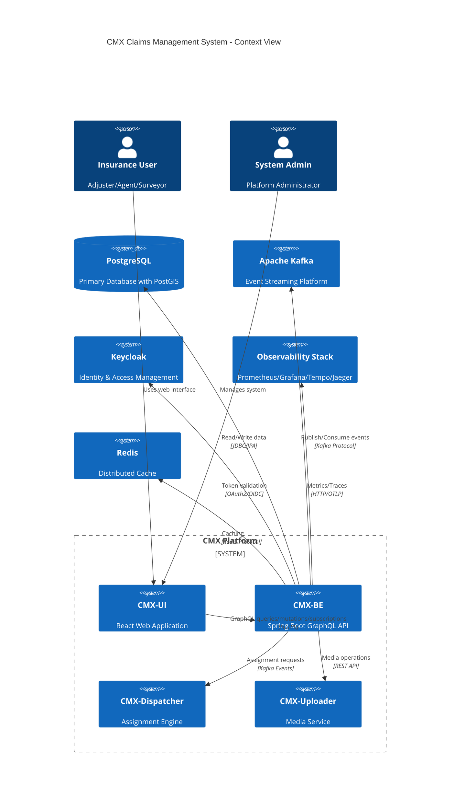
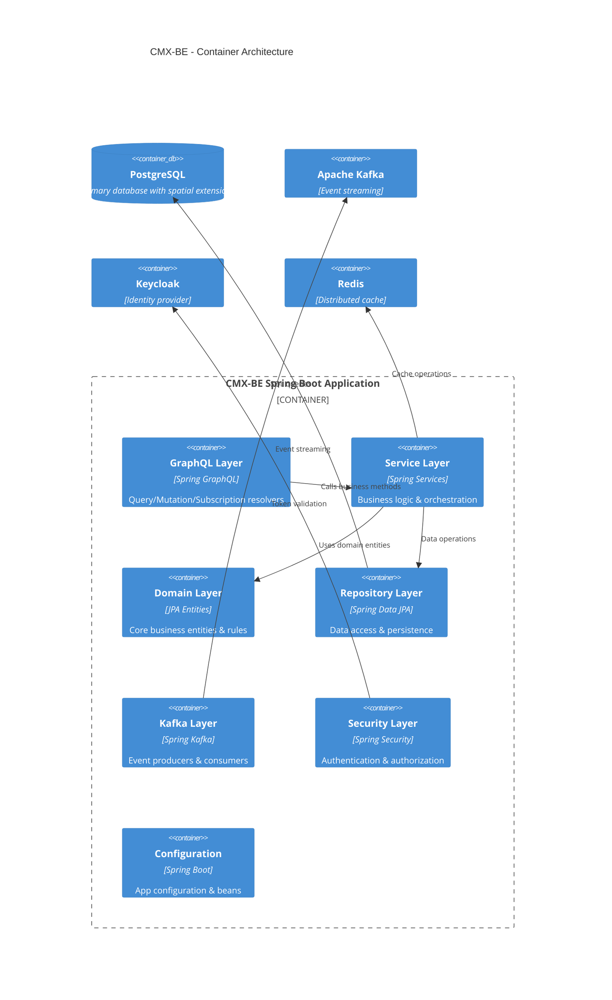
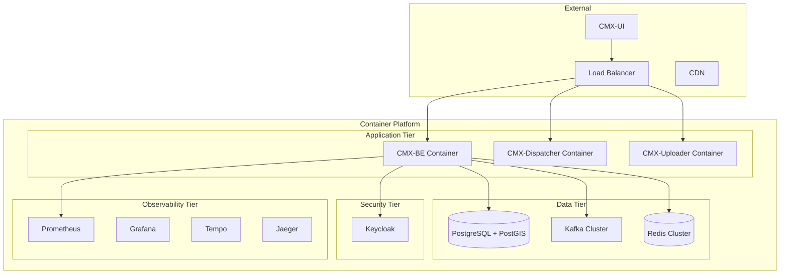

# CMX-BE Architecture Documentation

## System Context Diagram



## Container Diagram - CMX-BE Internal Architecture



## Component Diagram - Package Structure

```mermaid
C4Component
    title CMX-BE - Component Structure

    Component_Boundary(resolver, "GraphQL Resolvers") {
        Component(fnolResolver, "FNOL Resolver", "GraphQL Controller", "FNOL operations")
        Component(claimResolver, "Claim Resolver", "GraphQL Controller", "Claim operations")
        Component(policyResolver, "Policy Resolver", "GraphQL Controller", "Policy queries")
        Component(surveyorResolver, "Surveyor Resolver", "GraphQL Controller", "Surveyor management")
        Component(addressResolver, "Address Resolver", "GraphQL Controller", "Address operations")
    }

    Component_Boundary(services, "Business Services") {
        Component(fnolService, "FNOL Service", "Business Logic", "FNOL lifecycle management")
        Component(claimService, "Claim Service", "Business Logic", "Claim processing")
        Component(assignmentService, "Assignment Service", "Business Logic", "Surveyor assignment")
        Component(domainValidator, "Domain Validator", "Validation", "Business rule validation")
        Component(refGenerator, "Reference Generator", "Utility", "Business ID generation")
    }

    Component_Boundary(entities, "Domain Entities") {
        Component(fnolEntity, "FNOL", "JPA Entity", "First Notice of Loss")
        Component(claimEntity, "Claim", "JPA Entity", "Insurance Claim")
        Component(policyEntity, "Policy", "JPA Entity", "Insurance Policy")
        Component(vehicleEntity, "Vehicle", "JPA Entity", "Insured Vehicle")
        Component(insuredEntity, "Insured", "JPA Entity", "Insured Party")
        Component(surveyorEntity, "Surveyor", "JPA Entity", "Surveyor Resource")
        Component(addressEntity, "Address", "JPA Entity", "Geographic Location")
    }

    Component_Boundary(repos, "Repositories") {
        Component(fnolRepo, "FNOL Repository", "Spring Data JPA", "FNOL data access")
        Component(claimRepo, "Claim Repository", "Spring Data JPA", "Claim data access")
        Component(policyRepo, "Policy Repository", "Spring Data JPA", "Policy data access")
        Component(surveyorRepo, "Surveyor Repository", "Spring Data JPA", "Surveyor data access")
    }

    Component_Boundary(kafka, "Event Handling") {
        Component(kafkaProducer, "Kafka Producer", "Spring Kafka", "Domain event publishing")
        Component(kafkaConsumer, "Kafka Consumer", "Spring Kafka", "Event consumption")
        Component(eventFactory, "Event Factory", "Event Creation", "CloudEvents formatting")
    }

    Rel(fnolResolver, fnolService, "Business operations")
    Rel(claimResolver, claimService, "Business operations")
    Rel(fnolService, domainValidator, "Validation")
    Rel(fnolService, refGenerator, "ID generation")
    Rel(fnolService, fnolRepo, "Data persistence")
    Rel(fnolService, kafkaProducer, "Event publishing")
    Rel(fnolRepo, fnolEntity, "Entity mapping")
    Rel(assignmentService, kafkaProducer, "Assignment events")
```

## Technology Stack

### Core Framework
- **Spring Boot 3.2.3** - Main application framework
- **Java 17** - Runtime platform
- **Maven** - Build & dependency management

### API Layer
- **Spring GraphQL** - GraphQL implementation
- **GraphiQL** - GraphQL IDE for development

### Data Layer
- **Spring Data JPA** - Data access framework
- **Hibernate** - ORM with spatial support
- **PostgreSQL** - Primary database
- **PostGIS** - Spatial data extension
- **Redis** - Distributed caching
- **Caffeine** - Local caching

### Messaging & Events
- **Apache Kafka** - Event streaming platform
- **Spring Kafka** - Kafka integration
- **CloudEvents** - Event format standard

### Security
- **Spring Security** - Security framework
- **OAuth2 Resource Server** - Token-based auth
- **Keycloak** - Identity & access management
- **JWT** - Token format

### Observability
- **Spring Actuator** - Application monitoring
- **Micrometer** - Metrics collection
- **OpenTelemetry** - Distributed tracing
- **Prometheus** - Metrics storage
- **Grafana** - Metrics visualization
- **Tempo/Jaeger** - Trace visualization

### Development Tools
- **MapStruct** - DTO mapping
- **Lombok** - Boilerplate reduction
- **Bean Validation** - Input validation
- **Docker** - Containerization

## Deployment Architecture



## Configuration Profiles

### Development (dev)
- Local PostgreSQL database
- Local Kafka instance
- Local Keycloak
- GraphiQL enabled
- Detailed logging
- Hot reload enabled

### Production (prod)
- Managed database services
- Kafka cluster
- External identity provider
- Optimized logging
- Performance tuning
- Health checks enabled

## Key Design Patterns

### Domain-Driven Design (DDD)
- Aggregates: FNOL, Claim, Policy, Surveyor
- Value Objects: Address, Reference Numbers
- Domain Services: Validation, Assignment
- Repository Pattern: Data access abstraction

### Event-Driven Architecture
- Domain Events: FnolCreated, ClaimUpdated, SurveyorAssigned
- Event Sourcing: Audit trail through events
- CQRS: Separate read/write models where needed

### Clean Architecture
- Dependency Inversion: Core business logic independent
- Interface Segregation: Focused repository interfaces
- Single Responsibility: Each service has clear purpose

### Microservices Patterns
- API Gateway: Single entry point
- Service Discovery: Container orchestration
- Circuit Breaker: Resilience patterns
- Distributed Tracing: Request correlation