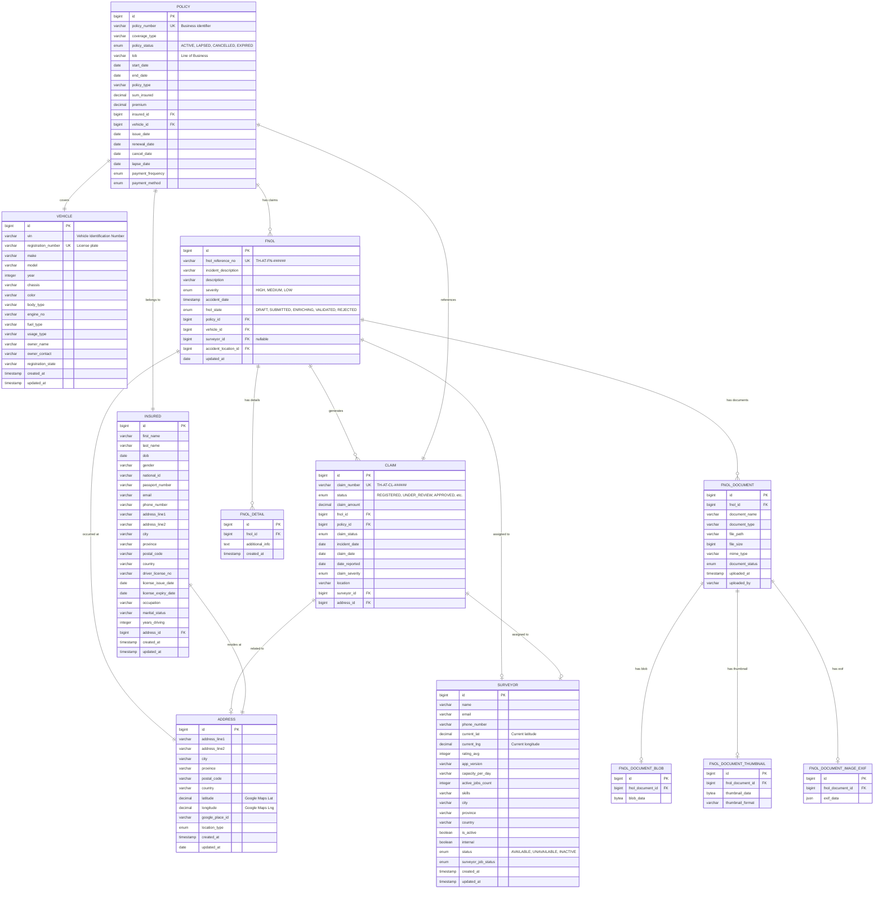

# Database Schema & Entity Relationships

## Entity Relationship Diagram



## Database Constraints & Indexes

### Primary Keys
- All tables use `BIGINT` auto-increment primary keys
- Generated using `IDENTITY` strategy

### Unique Constraints
```sql
-- Business identifiers must be unique
ALTER TABLE policy ADD CONSTRAINT uk_policy_number UNIQUE (policy_number);
ALTER TABLE fnol ADD CONSTRAINT uk_fnol_reference_no UNIQUE (fnol_reference_no);
ALTER TABLE claim ADD CONSTRAINT uk_claim_number UNIQUE (claim_number);
ALTER TABLE vehicle ADD CONSTRAINT uk_vehicle_registration UNIQUE (registration_number);
```

### Foreign Key Constraints
```sql
-- Policy relationships
ALTER TABLE policy ADD CONSTRAINT fk_policy_insured
    FOREIGN KEY (insured_id) REFERENCES insured(id);
ALTER TABLE policy ADD CONSTRAINT fk_policy_vehicle
    FOREIGN KEY (vehicle_id) REFERENCES vehicle(id);

-- FNOL relationships
ALTER TABLE fnol ADD CONSTRAINT fk_fnol_policy
    FOREIGN KEY (policy_id) REFERENCES policy(id);
ALTER TABLE fnol ADD CONSTRAINT fk_fnol_vehicle
    FOREIGN KEY (vehicle_id) REFERENCES vehicle(id);
ALTER TABLE fnol ADD CONSTRAINT fk_fnol_surveyor
    FOREIGN KEY (surveyor_id) REFERENCES surveyor(id);
ALTER TABLE fnol ADD CONSTRAINT fk_fnol_accident_location
    FOREIGN KEY (accident_location_id) REFERENCES address(id);

-- Claim relationships
ALTER TABLE claim ADD CONSTRAINT fk_claim_fnol
    FOREIGN KEY (fnol_id) REFERENCES fnol(id);
ALTER TABLE claim ADD CONSTRAINT fk_claim_policy
    FOREIGN KEY (policy_id) REFERENCES policy(id);
ALTER TABLE claim ADD CONSTRAINT fk_claim_surveyor
    FOREIGN KEY (surveyor_id) REFERENCES surveyor(id);
ALTER TABLE claim ADD CONSTRAINT fk_claim_address
    FOREIGN KEY (address_id) REFERENCES address(id);
```

### Check Constraints
```sql
-- Enum validations
ALTER TABLE policy ADD CONSTRAINT ck_policy_status
    CHECK (policy_status IN ('ACTIVE', 'LAPSED', 'CANCELLED', 'EXPIRED'));

ALTER TABLE fnol ADD CONSTRAINT ck_fnol_state
    CHECK (fnol_state IN ('DRAFT', 'SUBMITTED', 'ENRICHING', 'VALIDATED', 'REJECTED'));

ALTER TABLE claim ADD CONSTRAINT ck_claim_severity
    CHECK (claim_severity IN ('HIGH', 'MEDIUM', 'LOW'));

ALTER TABLE surveyor ADD CONSTRAINT ck_surveyor_status
    CHECK (status IN ('AVAILABLE', 'UNAVAILABLE', 'INACTIVE'));

-- Business rules
ALTER TABLE insured ADD CONSTRAINT ck_insured_years_driving
    CHECK (years_driving >= 0);

ALTER TABLE vehicle ADD CONSTRAINT ck_vehicle_year
    CHECK (year >= 1900 AND year <= EXTRACT(YEAR FROM CURRENT_DATE) + 1);
```

### Indexes for Performance

#### Business Identifier Indexes
```sql
-- Already covered by unique constraints
-- uk_policy_number, uk_fnol_reference_no, uk_claim_number, uk_vehicle_registration
```

#### Foreign Key Indexes
```sql
CREATE INDEX idx_fnol_policy_id ON fnol(policy_id);
CREATE INDEX idx_fnol_vehicle_id ON fnol(vehicle_id);
CREATE INDEX idx_fnol_surveyor_id ON fnol(surveyor_id);
CREATE INDEX idx_claim_fnol_id ON claim(fnol_id);
CREATE INDEX idx_claim_policy_id ON claim(policy_id);
CREATE INDEX idx_claim_surveyor_id ON claim(surveyor_id);
```

#### Query Optimization Indexes
```sql
-- FNOL state queries
CREATE INDEX idx_fnol_state ON fnol(fnol_state);

-- Active policy queries
CREATE INDEX idx_policy_active ON policy(policy_status)
    WHERE policy_status = 'ACTIVE';

-- Surveyor availability queries
CREATE INDEX idx_surveyor_available ON surveyor(status, is_active)
    WHERE status = 'AVAILABLE' AND is_active = true;

-- Date range queries
CREATE INDEX idx_fnol_accident_date ON fnol(accident_date);
CREATE INDEX idx_claim_date_reported ON claim(date_reported);
```

#### Spatial Indexes (PostGIS)
```sql
-- Geographic queries for surveyor assignment
CREATE INDEX idx_address_location ON address
    USING GIST (ST_Point(longitude, latitude));

CREATE INDEX idx_surveyor_location ON surveyor
    USING GIST (ST_Point(current_lng, current_lat))
    WHERE current_lat IS NOT NULL AND current_lng IS NOT NULL;
```

## Sequence Generators

### Business Number Generation
```sql
-- FNOL reference number sequence
CREATE SEQUENCE fnol_no_seq START 1;

-- Claim number sequence
CREATE SEQUENCE claim_no_seq START 1;

-- Database function for formatted FNOL reference
CREATE OR REPLACE FUNCTION next_fnol_reference()
RETURNS VARCHAR AS $$
BEGIN
    RETURN 'TH-AT-FN-' || LPAD(nextval('fnol_no_seq')::TEXT, 6, '0');
END;
$$ LANGUAGE plpgsql;

-- Database function for formatted claim number
CREATE OR REPLACE FUNCTION next_claim_number()
RETURNS VARCHAR AS $$
BEGIN
    RETURN 'TH-AT-CL-' || LPAD(nextval('claim_no_seq')::TEXT, 6, '0');
END;
$$ LANGUAGE plpgsql;
```

## Data Types & Enums

### FNOL State Machine
```
DRAFT → SUBMITTED → ENRICHING → VALIDATED
                                     ↓
                                REJECTED
```

### Claim Status Lifecycle
```
REGISTERED → UNDER_REVIEW → APPROVAL_PENDING → APPROVED → WORK_IN_PROGRESS → PAID → CLOSED
                    ↓              ↓                                ↓
                REJECTED       REJECTED                        REOPENED
```

### Surveyor Status
- **AVAILABLE**: Ready for new assignments
- **UNAVAILABLE**: Temporarily not available
- **INACTIVE**: Account disabled

## Audit & Timestamps

### Audit Columns
All business tables include:
- `created_at`: Timestamp of record creation
- `updated_at`: Timestamp of last modification
- `created_by`: User who created the record (planned)
- `updated_by`: User who last modified the record (planned)

### Temporal Data
- Policy effective dates: `start_date`, `end_date`
- Claim reporting dates: `incident_date`, `claim_date`, `date_reported`
- License validity: `license_issue_date`, `license_expiry_date`

## Partitioning Strategy (Future)

### Time-based Partitioning
```sql
-- Partition FNOL by accident_date (monthly)
CREATE TABLE fnol_y2024m01 PARTITION OF fnol
    FOR VALUES FROM ('2024-01-01') TO ('2024-02-01');

-- Partition claims by date_reported (quarterly)
CREATE TABLE claim_q1_2024 PARTITION OF claim
    FOR VALUES FROM ('2024-01-01') TO ('2024-04-01');
```

### Geographic Partitioning
```sql
-- Partition by province/region for large datasets
CREATE TABLE surveyor_bangkok PARTITION OF surveyor
    FOR VALUES IN ('Bangkok', 'Nonthaburi', 'Pathum Thani');
```