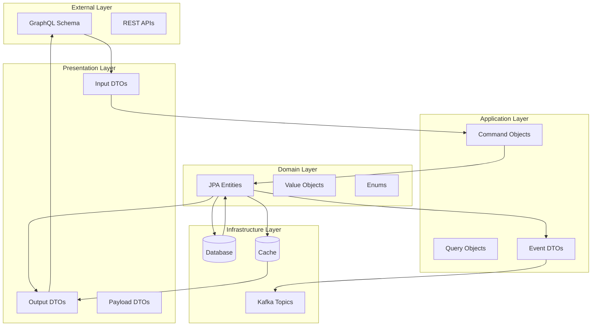
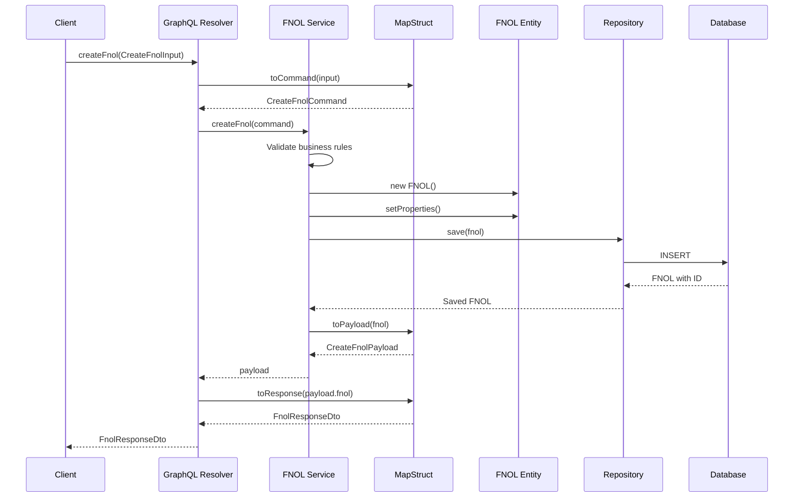
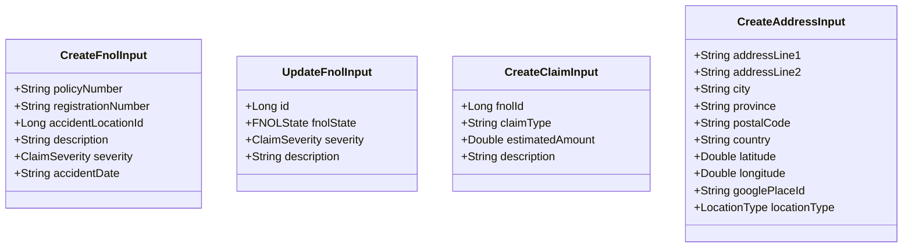
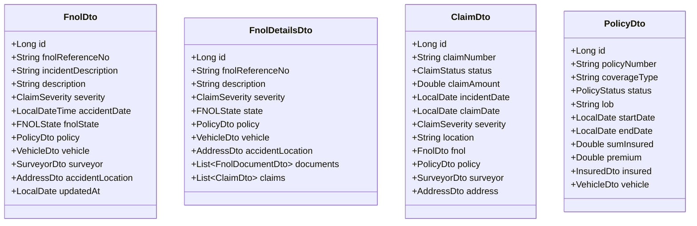
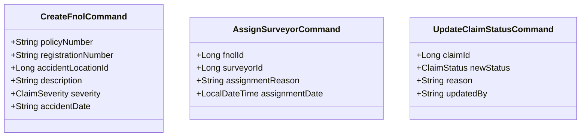
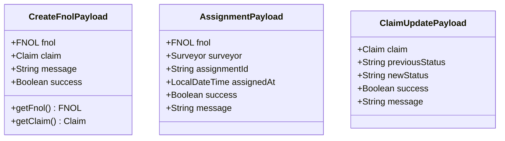
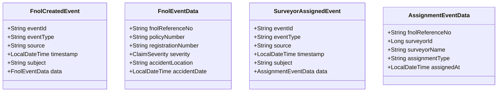
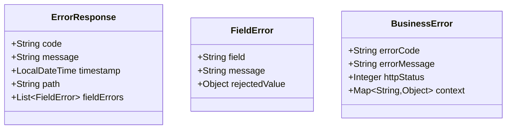

# DTO Mapping & Data Flow

## DTO Architecture Overview



## DTO Mapping Strategy

### MapStruct Configuration
```java
@Mapper(componentModel = "spring",
        unmappedTargetPolicy = ReportingPolicy.IGNORE,
        nullValuePropertyMappingStrategy = NullValuePropertyMappingStrategy.IGNORE)
public interface FnolMapper {

    // Entity to DTO
    FnolDto toDto(FNOL entity);
    List<FnolDto> toDtos(List<FNOL> entities);

    // Input DTO to Command
    CreateFnolCommand toCommand(CreateFnolInput input);

    // Entity to Response Payload
    FnolResponseDto toResponse(FNOL entity);

    // Custom mappings
    @Mapping(target = "accidentLocation", source = "accidentLocation")
    @Mapping(target = "policyDetails", source = "policy")
    FnolDetailsDto toDetailsDto(FNOL entity);
}
```

## FNOL Data Flow



## DTO Class Structure

### Input DTOs (Mutations)



### Output DTOs (Responses)



### Command Objects (Internal)



## Payload Wrappers

### Mutation Payloads



## Event DTOs

### Domain Events



## Validation & Constraints

### Input Validation

```java
public class CreateFnolInput {
    @NotBlank(message = "Policy number is required")
    @Pattern(regexp = "^[A-Z0-9-]+$", message = "Invalid policy number format")
    private String policyNumber;

    @NotBlank(message = "Registration number is required")
    @Size(min = 3, max = 20, message = "Registration number must be 3-20 characters")
    private String registrationNumber;

    @NotNull(message = "Accident location is required")
    @Positive(message = "Invalid location ID")
    private Long accidentLocationId;

    @NotBlank(message = "Description is required")
    @Size(max = 1000, message = "Description too long")
    private String description;

    @NotNull(message = "Severity is required")
    private ClaimSeverity severity;

    @NotBlank(message = "Accident date is required")
    @Pattern(regexp = "^\\d{4}-\\d{2}-\\d{2}T\\d{2}:\\d{2}:\\d{2}$")
    private String accidentDate;
}
```

### Custom Validation

```java
@Component
public class FnolInputValidator {

    public void validateCreateFnolInput(CreateFnolInput input) {
        // Business rule validations
        validateAccidentDateNotFuture(input.getAccidentDate());
        validatePolicyNumberFormat(input.getPolicyNumber());
        validateRegistrationFormat(input.getRegistrationNumber());
    }

    private void validateAccidentDateNotFuture(String accidentDate) {
        LocalDateTime parsed = TimeParsers.parseAccidentDateOrThrow(accidentDate);
        if (parsed.isAfter(LocalDateTime.now())) {
            throw new ValidationException("Accident date cannot be in the future");
        }
    }
}
```

## Error Handling

### Error Response DTOs



## Mapping Performance Considerations

### Lazy Loading Strategy
```java
@Mapper(componentModel = "spring")
public interface FnolMapper {

    // Shallow mapping for list views
    @Mapping(target = "policy.insured", ignore = true)
    @Mapping(target = "vehicle.engineDetails", ignore = true)
    FnolSummaryDto toSummaryDto(FNOL entity);

    // Deep mapping for detail views
    @Mapping(target = "policy", qualifiedByName = "mapPolicyWithDetails")
    @Mapping(target = "claims", qualifiedByName = "mapClaimsWithDetails")
    FnolDetailsDto toDetailsDto(FNOL entity);

    @Named("mapPolicyWithDetails")
    default PolicyDto mapPolicyWithDetails(Policy policy) {
        // Custom mapping logic for complex relationships
    }
}
```

### Caching Strategy
```java
@Service
@CacheConfig(cacheNames = "fnolDtos")
public class FnolMappingService {

    @Cacheable(key = "#fnol.id + '_summary'")
    public FnolSummaryDto toSummaryDto(FNOL fnol) {
        return fnolMapper.toSummaryDto(fnol);
    }

    @Cacheable(key = "#fnol.id + '_details'")
    public FnolDetailsDto toDetailsDto(FNOL fnol) {
        return fnolMapper.toDetailsDto(fnol);
    }
}
```

## API Documentation Integration

### GraphQL Schema Documentation
```graphql
"""
Input for creating a new FNOL (First Notice of Loss)
"""
input CreateFnolInput {
  """Policy number in format: POL-YYYYMMDD-XXXX"""
  policyNumber: String!

  """Vehicle registration number"""
  registrationNumber: String!

  """ID of the accident location address"""
  accidentLocationId: ID!

  """Description of the incident (max 1000 characters)"""
  description: String!

  """Severity level of the claim"""
  severity: ClaimSeverity!

  """Accident date and time in ISO format"""
  accidentDate: String!
}

"""
Response payload for FNOL creation
"""
type CreateFnolPayload {
  """The created FNOL record"""
  fnol: Fnol!

  """Associated claim if auto-generated"""
  claim: Claim

  """Success status"""
  success: Boolean!

  """Result message"""
  message: String
}
```