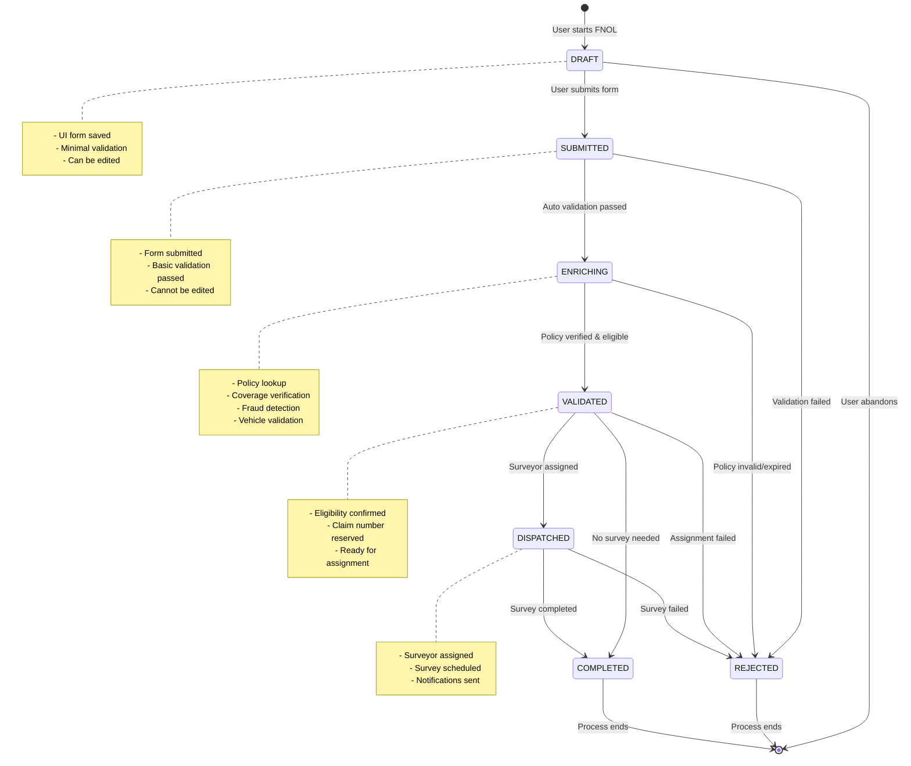
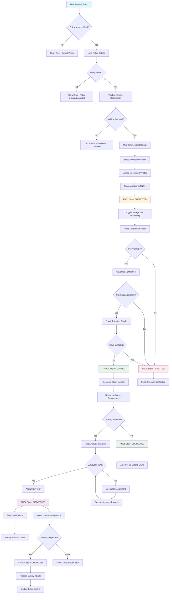
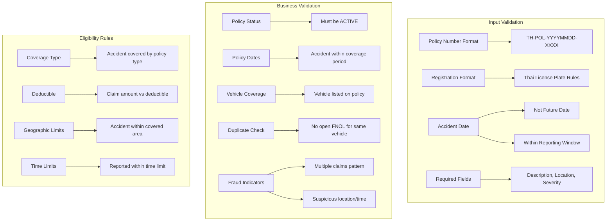
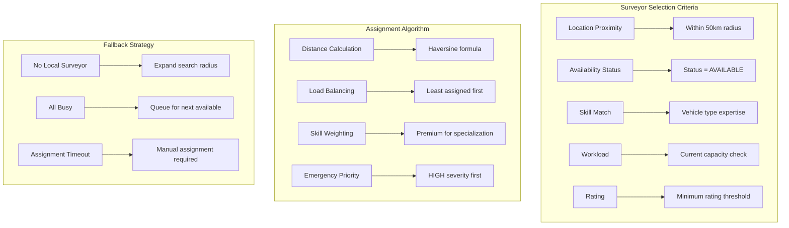
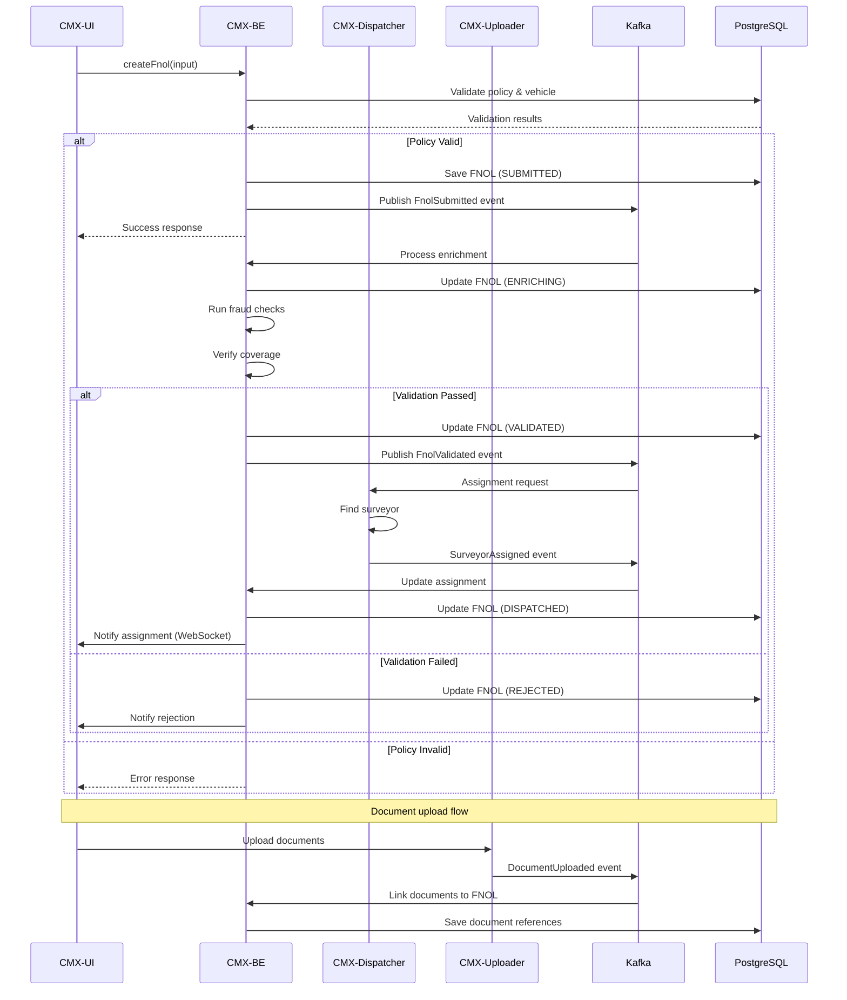
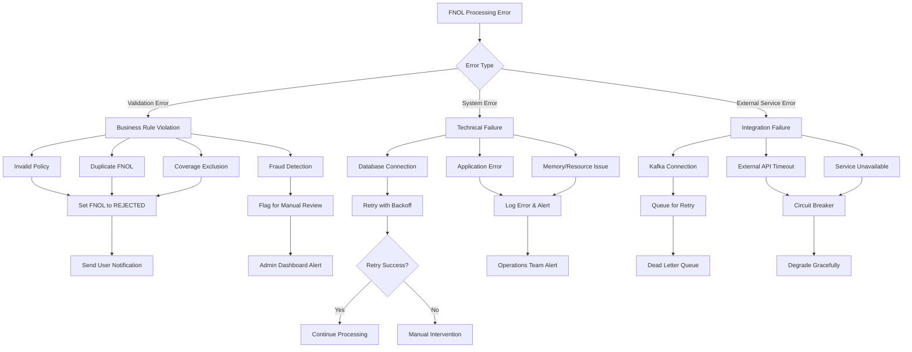
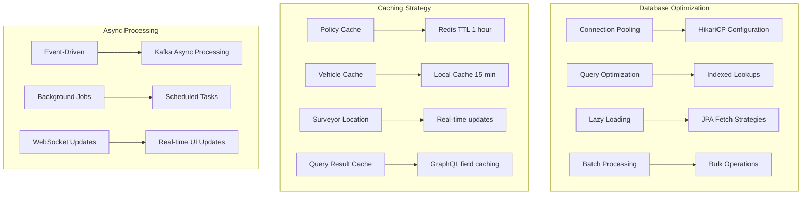
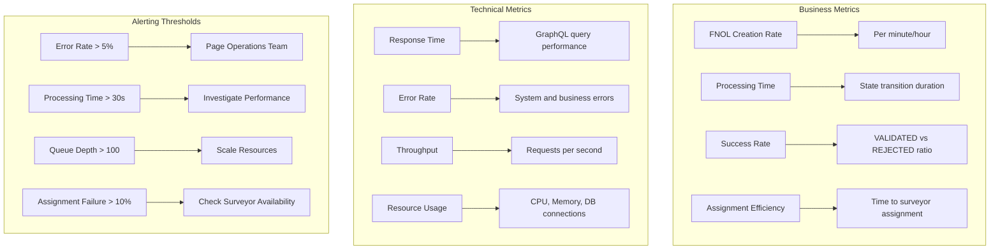

# FNOL (First Notice of Loss) Workflow

## FNOL State Machine



## Complete FNOL Process Flow



## FNOL Business Rules

### Validation Rules



### Assignment Rules



## Integration Points

### External System Interactions



## Error Handling & Recovery

### Error Scenarios



### Recovery Mechanisms

#### Idempotency
```java
@Service
public class FnolService {

    @Transactional
    @Idempotent(key = "#command.idempotencyKey")
    public CreateFnolPayload createFnol(CreateFnolCommand command) {
        // Check if FNOL already exists for this key
        if (fnolRepository.existsByIdempotencyKey(command.getIdempotencyKey())) {
            return fnolRepository.findByIdempotencyKey(command.getIdempotencyKey());
        }
        // Proceed with creation
    }
}
```

#### Retry Logic
```java
@Retryable(
    value = {DataAccessException.class, KafkaException.class},
    maxAttempts = 3,
    backoff = @Backoff(delay = 1000, multiplier = 2)
)
public void publishFnolEvent(FnolEvent event) {
    kafkaTemplate.send("fnol-events", event);
}

@Recover
public void recoverFromPublishFailure(Exception ex, FnolEvent event) {
    // Store in dead letter queue or database for manual processing
    deadLetterService.store(event, ex);
}
```

## Performance Considerations

### Optimization Strategies



### Monitoring & Metrics

