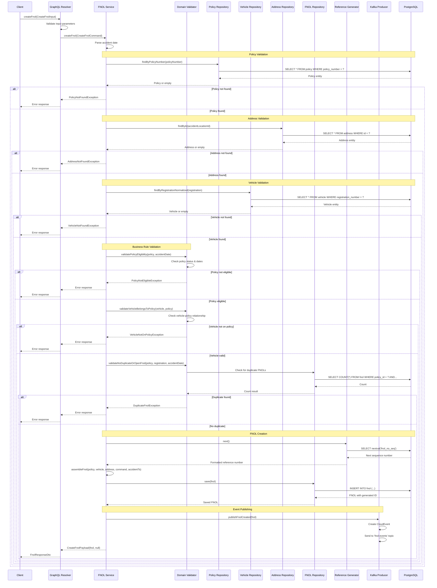
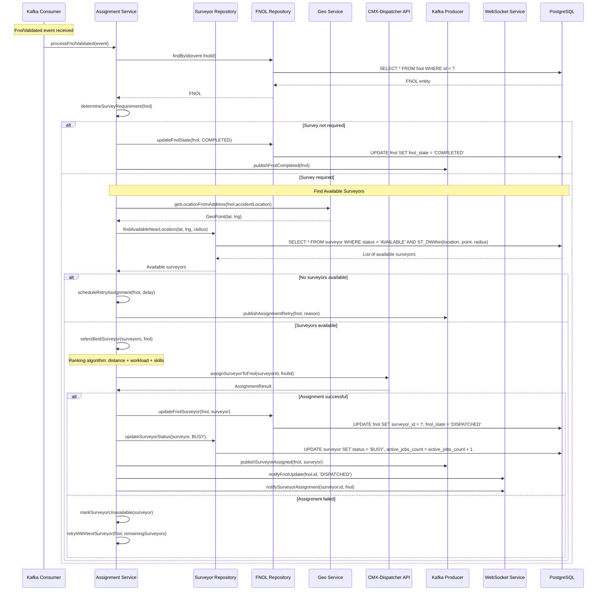
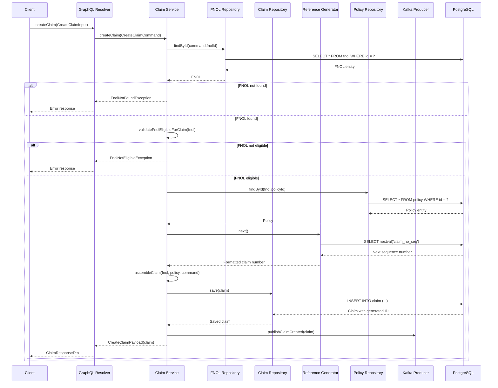
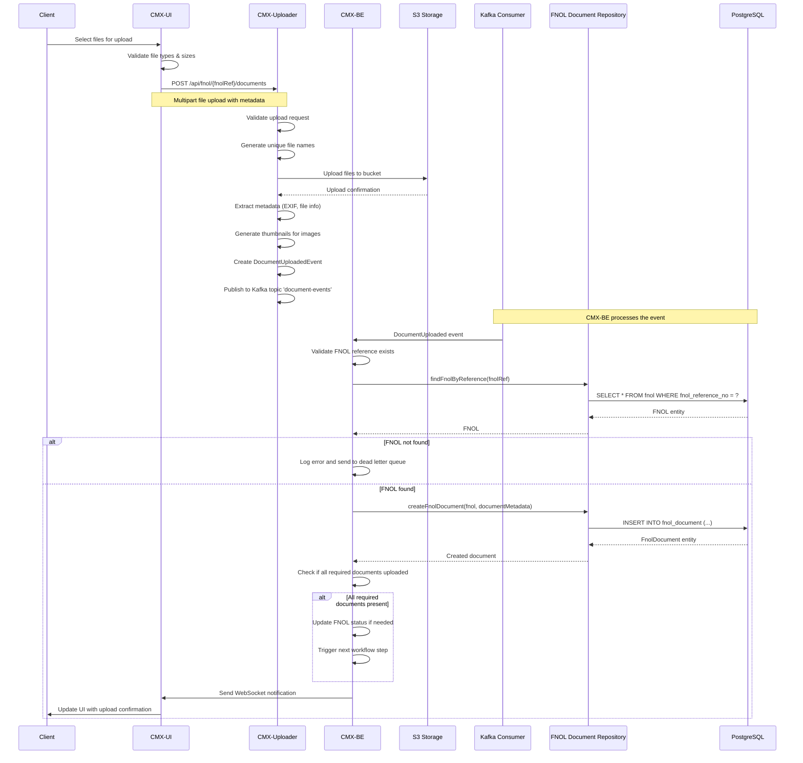
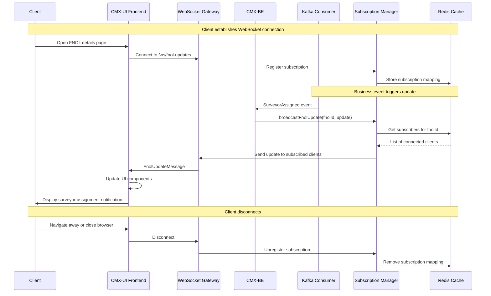
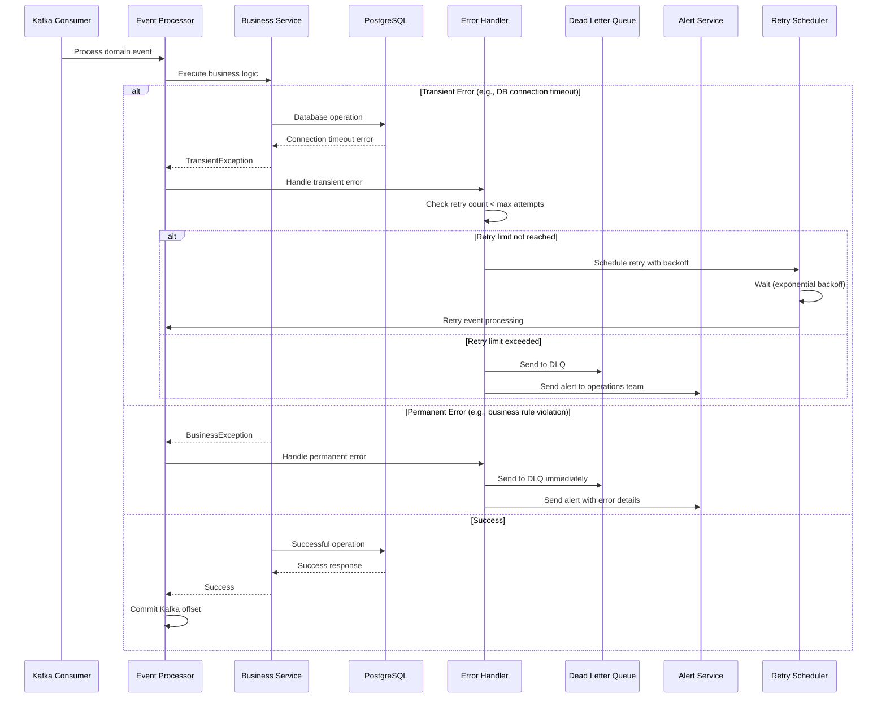
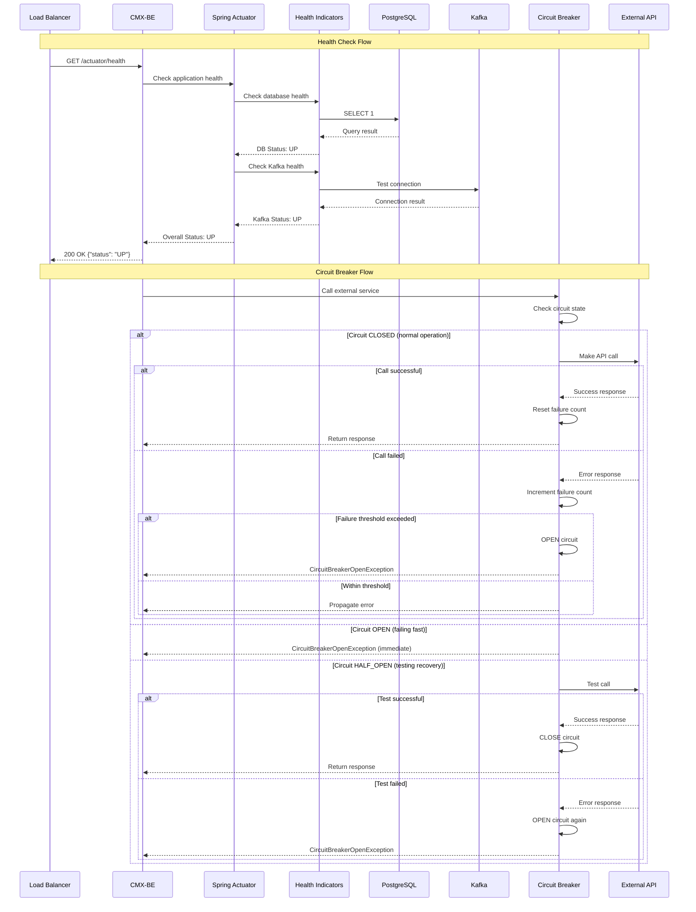

# Sequence Diagrams - Key Operations

## 1. FNOL Creation Flow

## 2. Surveyor Assignment Flow

## 3. Claim Creation Flow

## 4. Document Upload Flow

## 5. Real-time Updates Flow (WebSocket)

## 6. Error Handling & Retry Flow

## 7. Health Check & Circuit Breaker Flow

